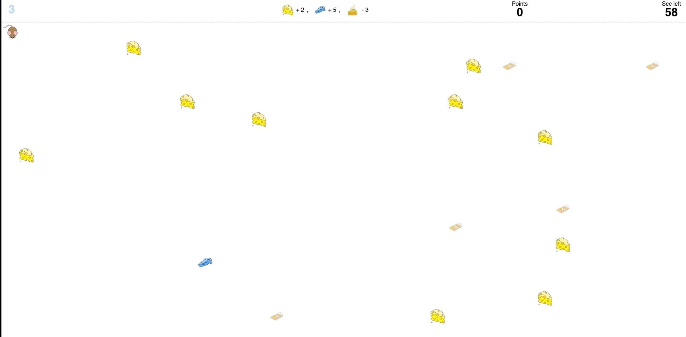

# Cheesy Game

[Play Game](https://hahiii.github.io/cheesy/)

## Setup
This project uses vanilla JavaScript, CSS and HTML.

## Running the project
Clone the repository, then as there are no dependencies, you can straight away run localhost like: python -m http.server 1234 The local server will be then running on localhost:1234